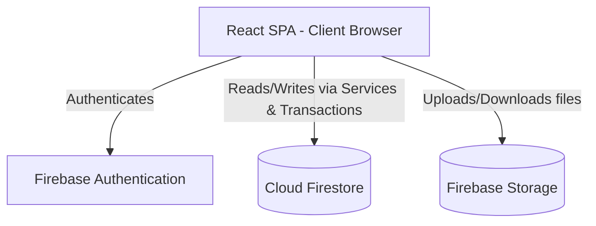
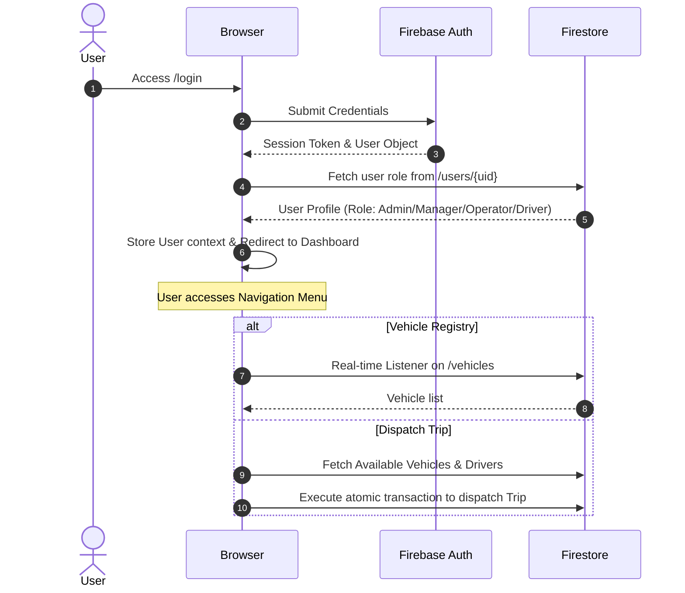

# TransitOps - Smart Transport Operations Platform
## Technical Architecture & Implementation Plan

This implementation plan serves as a comprehensive architectural blueprint for building **TransitOps** during an 8-hour hackathon. The system relies entirely on a serverless architecture using React (Vite + TypeScript + Tailwind CSS) and Firebase (Authentication, Firestore, and Cloud Storage).

---

## 1. Overall System Architecture

TransitOps is a serverless Single Page Application (SPA). Because there is **no custom backend server**, security, integrity, and business logic are enforced on the client side using robust service/transaction layers, and on the data layer using Firestore Security Rules.



*   **React (Vite + TS):** Serves the UI, manages client state, and coordinates all CRUD calls using a repository/service pattern.
*   **Firebase Authentication:** Handles identity verification, session persistence, and embeds custom claims (or retrieves custom role documents) for Role-Based Access Control (RBAC).
*   **Cloud Firestore:** Document database utilizing sub-second updates. Transactions (`runTransaction`) are used to enforce multi-document consistency (e.g., dispatching a trip update driver, vehicle, and trip statuses atomically).
*   **Firebase Storage:** Optional asset store for driver license scans, vehicle maintenance receipts, and expense invoices.

---

## 2. Application Flow



1.  **Unauthenticated Entry:** Accessing any route redirects to `/login`.
2.  **Authentication & Profile Load:** User logs in. The system queries the `/users` collection mapping the authenticated `uid` to retrieve their assigned role (`admin`, `manager`, `operator`, `driver`).
3.  **Role-Based Redirection:**
    *   **Admin/Manager/Operator:** Redirected to the primary metrics Dashboard.
    *   **Driver:** Redirected to a mobile-responsive "My Trips" dashboard.
4.  **Operational Journeys:**
    *   **Registration:** Operator registers new Driver or Vehicle. Input validation checked locally.
    *   **Maintenance:** Vehicle sent to shop -> status changed to "In Shop" -> locks vehicle from dispatch.
    *   **Dispatching:** Trip is configured. The system checks capacity, driver availability, and vehicle availability. If valid, an atomic Firebase transaction creates the Trip doc, changes driver to `On Trip`, and vehicle to `On Trip`.
    *   **Completing/Cancelling:** Trip marked complete -> Driver status to `Available`, Vehicle to `Available`, trip status updated.

---

## 3. Firestore Database Design

All documents contain standard audit fields: `createdAt` (Timestamp), `updatedAt` (Timestamp), `createdBy` (String - UID), and `updatedBy` (String - UID).

### Collection: `users`
*   **Path:** `/users/{uid}`
*   **Document Structure:**
    ```typescript
    interface UserDoc {
      uid: string;
      email: string;
      fullName: string;
      role: 'admin' | 'manager' | 'operator' | 'driver';
      phoneNumber?: string;
      status: 'active' | 'suspended';
      createdAt: Timestamp;
      updatedAt: Timestamp;
    }
    ```

### Collection: `vehicles`
*   **Path:** `/vehicles/{vehicleId}`
*   **Document Structure:**
    ```typescript
    interface VehicleDoc {
      id: string;
      plateNumber: string; // Unique index (enforced client-side via transaction/lookup and rules)
      make: string;
      model: string;
      year: number;
      type: 'truck' | 'van' | 'car' | 'trailer';
      cargoCapacityKg: number;
      fuelType: 'diesel' | 'gasoline' | 'electric' | 'hybrid';
      status: 'available' | 'on_trip' | 'maintenance' | 'retired';
      currentMileage: number;
      insuranceExpiry: Timestamp;
      createdAt: Timestamp;
      updatedAt: Timestamp;
    }
    ```

### Collection: `drivers`
*   **Path:** `/drivers/{driverId}`
*   **Document Structure:**
    ```typescript
    interface DriverDoc {
      id: string;
      fullName: string;
      email: string;
      phoneNumber: string;
      licenseNumber: string;
      licenseClass: string;
      licenseExpiry: Timestamp;
      status: 'available' | 'on_trip' | 'suspended' | 'off_duty';
      assignedVehicleId?: string; // Optional default vehicle assignment
      createdAt: Timestamp;
      updatedAt: Timestamp;
    }
    ```

### Collection: `trips`
*   **Path:** `/trips/{tripId}`
*   **Document Structure:**
    ```typescript
    interface TripDoc {
      id: string;
      tripNumber: string; 
      vehicleId: string;
      driverId: string;
      status: 'scheduled' | 'on_trip' | 'completed' | 'cancelled';
      origin: string;
      destination: string;
      cargoDescription: string;
      cargoWeightKg: number;
      departureTime?: Timestamp;
      arrivalTime?: Timestamp;
      estimatedDistanceKm: number;
      actualDistanceKm?: number;
      fuelConsumedLiters?: number;
      notes?: string;
      createdAt: Timestamp;
      updatedAt: Timestamp;
    }
    ```

### Collection: `maintenanceLogs`
*   **Path:** `/maintenanceLogs/{logId}`
*   **Document Structure:**
    ```typescript
    interface MaintenanceLogDoc {
      id: string;
      vehicleId: string;
      type: 'routine' | 'repair' | 'inspection' | 'breakdown';
      description: string;
      status: 'scheduled' | 'in_progress' | 'completed';
      cost: number;
      scheduledDate: Timestamp;
      startDate?: Timestamp;
      completionDate?: Timestamp;
      odometerReading: number;
      performedBy: string; 
      createdAt: Timestamp;
      updatedAt: Timestamp;
    }
    ```

### Collection: `fuelLogs`
*   **Path:** `/fuelLogs/{logId}`
*   **Document Structure:**
    ```typescript
    interface FuelLogDoc {
      id: string;
      vehicleId: string;
      driverId: string;
      tripId?: string;
      date: Timestamp;
      liters: number;
      costPerLiter: number;
      totalCost: number;
      odometerReading: number;
      fuelStation: string;
      createdAt: Timestamp;
      updatedAt: Timestamp;
    }
    ```

### Collection: `expenses`
*   **Path:** `/expenses/{expenseId}`
*   **Document Structure:**
    ```typescript
    interface ExpenseDoc {
      id: string;
      category: 'fuel' | 'maintenance' | 'toll' | 'driver_allowance' | 'insurance' | 'permit' | 'other';
      amount: number;
      date: Timestamp;
      vehicleId?: string;
      driverId?: string;
      tripId?: string;
      description: string;
      status: 'pending' | 'approved' | 'rejected';
      invoiceUrl?: string; 
      createdAt: Timestamp;
      updatedAt: Timestamp;
    }
    ```

---

## 4. Authentication & RBAC

### User Roles & Permissions Matrix

| Module / Action | Admin | Manager | Operator | Driver |
| :--- | :---: | :---: | :---: | :---: |
| **System Settings / Manage Users** | Read/Write | None | None | None |
| **Dashboard / Financial Analytics** | Read | Read | None | None |
| **Vehicle / Driver Registry** | Read/Write | Read/Write | Read/Write | Read Only (Self) |
| **Trip Dispatching & Status** | Read/Write | Read/Write | Read/Write | Update Status Only |
| **Maintenance & Fuel Logs** | Read/Write | Read/Write | Read/Write | Create Fuel Log Only |
| **Expense Approvals** | Read/Write | Read/Write | None | None |

### Route Protection

Implemented using React Router Dom loader functions or higher-order Route Guard components:
*   `PublicRoute`: Access only if not logged in (e.g. `/login`).
*   `ProtectedRoute`: Access only if logged in.
*   `RoleRoute`: Access only if logged in AND user profile contains allowed role.

---

## 5. Folder Structure

A scalable structure with clean boundaries for context, UI state, layout, and service layer:

```text
src/
├── assets/             # Images, svgs
├── components/         # Reusable presentation components
│   ├── ui/             # Core UI components (Buttons, Inputs, Modals, Cards, Select)
│   ├── charts/         # Reusable Recharts graphs
│   ├── Layout.tsx      # Sidebar, navbar wrapper
│   └── RouteGuard.tsx  # Auth and role checks
├── context/            # AuthContext, GlobalStateContext
├── hooks/              # Custom hooks (e.g. useFirestoreQuery)
├── pages/              # Module Pages
│   ├── Login.tsx
│   ├── Dashboard.tsx
│   ├── Vehicles.tsx
│   ├── Drivers.tsx
│   ├── Trips.tsx
│   ├── Maintenance.tsx
│   ├── Fuel.tsx
│   ├── Expenses.tsx
│   ├── Reports.tsx
│   └── DriverPortal.tsx # Dedicated view for drivers
├── services/           # Firebase Service Layer
│   ├── firebase.ts     # Config and client initialization
│   ├── auth.ts         # User auth functions
│   ├── db.ts           # CRUD helper factory
│   └── operations.ts   # Core atomic transactions (dispatch, complete maintenance)
├── types/              # TypeScript interface definitions
│   └── index.ts
├── utils/              # Export formatters, PDF makers, date helpers
│   ├── format.ts
│   └── export.ts
├── App.tsx
├── index.css
└── main.tsx
```

---

## 6. Component Architecture

*   **`Layout`:** Contains responsive Sidebar (collapsible for mobile), Top Header (user profile dropdown, logout), and children content container.
*   **`Button`:** Generic styled component with support for sizes, loading states, and styles.
*   **`Input` / `Select` / `TextArea`:** Accessible form input fields wrapped with Tailwind styling and validation error message hooks.
*   **`DataTable`:** Renders lists of items with built-in sorting, filtering, searching, and pagination.
*   **`Modal` / `SlideOver`:** Reusable dialog with backdrop, transition animations, and form submit handlers.
*   **`StatusBadge`:** Colors status indicators contextually.
*   **`KPICard`:** Standardised metrics container displaying current value, period trend, and primary icon.
*   **`CustomChart`:** Wrapper for Recharts curves (Area, Bar, Pie) with loaders and unified tooltips.

---

## 7. Page Structure

1.  **`Login`**: Standard login form with validation, handles custom error logs, redirects user.
2.  **`Dashboard`**: KPI Grid, Active Trips Map Mock / Live Feed, Monthly fleet expenditure chart.
3.  **`Vehicles`**: Grid/List of vehicles with registration modal, filters, mileage history.
4.  **`Drivers`**: Driver list with license warnings, status controls, assignment modal.
5.  **`Trips`**: Active/Upcoming trips table. "Dispatch New Trip" multi-step form.
6.  **`Maintenance`**: Table of active logs, schedule routine checkups, close maintenance record forms.
7.  **`Fuel`**: Log list detailing liters filled, trip logs integration, average fuel cost tracker.
8.  **`Expenses`**: Complete list of financial outflows, filterable by status, approval/rejection buttons.
9.  **`Reports`**: Date-range filters, custom chart grids, and buttons for Excel/CSV/PDF download.
10. **`DriverPortal`**: Minimalist portal tailored for driver roles (mobile first).

---

## 8. Firestore Service Layer

Using a generic Firestore CRUD service layer to prevent boilerplate, with explicit operations for transaction workflows:

### Complex Atomic Transaction Functions (`operations.ts`)
```typescript
import { db } from './firebase';
import { doc, runTransaction, collection } from 'firebase/firestore';

// 1. Dispatch Trip Transaction
export async function dispatchTrip(tripData: any) {
  return runTransaction(db, async (transaction) => {
    const vehicleRef = doc(db, 'vehicles', tripData.vehicleId);
    const driverRef = doc(db, 'drivers', tripData.driverId);
    const tripRef = doc(collection(db, 'trips'));

    const vehicleSnap = await transaction.get(vehicleRef);
    const driverSnap = await transaction.get(driverRef);

    if (!vehicleSnap.exists() || vehicleSnap.data().status !== 'available') {
      throw new Error('Vehicle is no longer available');
    }
    if (!driverSnap.exists() || driverSnap.data().status !== 'available') {
      throw new Error('Driver is no longer available');
    }
    if (tripData.cargoWeightKg > vehicleSnap.data().cargoCapacityKg) {
      throw new Error('Cargo weight exceeds vehicle capacity');
    }

    transaction.set(tripRef, {
      ...tripData,
      status: 'on_trip',
      departureTime: new Date(),
      createdAt: new Date(),
    });
    transaction.update(vehicleRef, { status: 'on_trip' });
    transaction.update(driverRef, { status: 'on_trip' });
  });
}
```

---

## 9. State Management

For an 8-hour hackathon, we choose a hybrid state management model: **React Context API + Custom Hooks**.
*   **Why React Context?** Native, easy to integrate with Firebase Auth callbacks. We will have an `AuthContext` to persist the current logged-in user profile and permissions throughout the app lifecycle.
*   **Data caching:** We will fetch Firestore data directly inside module pages using real-time Firestore listeners (`onSnapshot`) combined with custom hooks (e.g. `useFirestoreDocs`). This ensures views automatically sync across sessions without manually updating global states.

---

## 10. Business Logic & Validation

1.  **Form Layer (Client):** Input sanitization, checking capacities.
2.  **Service/Transaction Layer (Client):** Validations using Firebase Transactions (`runTransaction`). For instance, before committing a trip, we query current driver and vehicle status documents.
3.  **Data Schema / Constraint Layer (Firestore Rules):** Enforce field validations directly in `firestore.rules`.

---

## 11. Dashboard KPIs

KPIs are calculated in real-time or memoized on data change:

1.  **Active Vehicles:** Count of vehicles where status == 'on_trip'
2.  **Vehicle Utilization Rate:** (Vehicles on trip + Vehicles in maintenance) / Total Vehicles * 100
3.  **Active Trips:** Count of trips where status == 'on_trip'
4.  **Available Drivers:** Count of drivers where status == 'available'
5.  **Monthly Operating Costs:** Sum expenses.amount where status == 'approved' and date in current month

---

## 12. Reports & Analytics

1.  **Fuel Efficiency Curve:** Scatter or line plot displaying distance vs. fuel consumption.
2.  **Fleet Operating Costs (Stacked Bar):** Aggregated monthly expenses grouped by categories.
3.  **Driver Performance:** Total completed distance, hours logged, and number of trips.
4.  **CSV/PDF Export:** Standard array-to-CSV parser using client-side blob downloads, PDF layout styling.

---

## 13. UI/UX Design System

*   **Color Palette:** Sleek corporate Dark/Light mode theme. Primary Slate Blue (`#1E293B`), Accent Emerald/Turquoise (`#10B981` / `#06B6D4`).
*   **Typography:** Google Font `Outfit` or `Inter`.
*   **Icons:** Lucide React.
*   **Layout Structure:** Collapsible left-side navigation panel, top action bar with search filters, page body wrapped in sleek frosted-glass effect cards.

---

## 14. 8-Hour Development Roadmap (4 Phases)

| Phase | Duration | Scope & Deliverables | Dependencies |
| :--- | :---: | :--- | :--- |
| **Phase 1: Foundation** | 2 Hours | React project setup, Tailwind configuration, Firebase initialization, Auth Context & Login flow, base UI components (Button, Input, Layout, Navigation). | Firebase Project created |
| **Phase 2: Registry & Role Auth** | 2 Hours | Vehicle Registry & Driver Management (CRUD + schema constraints). Dashboard basic structure with KPI metrics. | Phase 1 Auth context |
| **Phase 3: Operations & Logic** | 2.5 Hours | Trip Dispatch multi-step forms. Complex Atomic Transactions (`dispatchTrip`, `completeTrip`). Maintenance logs linking to Vehicle statuses. | Phase 2 registries |
| **Phase 4: Finance & Analytics** | 1.5 Hours | Fuel Logs, Expenses Approval logic. Reports charting (Recharts), CSV & PDF generation. Final testing and responsive checks. | Phase 3 data streams |

---

## 15. Risks & Edge Cases

*   **Race Conditions on Dispatch:** Handled via Firestore `runTransaction` acquiring a lock.
*   **Scale Limitation:** Structure lists to paginate using indexes or startAfter timestamps.
*   **License Expiration Checking:** Local calculation on driver load checking if date difference < 30 days.

---

## 16. Best Practices

*   **TypeScript Strict Mode:** Maintain type definitions for all Firestore docs. Never use `any`.
*   **Queries & Indexes:** Avoid complex multi-field compound queries unless composite indexes are defined.
*   **Atomic Updates:** Always use `serverTimestamp()` for date stamps.
*   **Reusable Utilities:** Centralized currency, date, and mileage formatting libraries.
